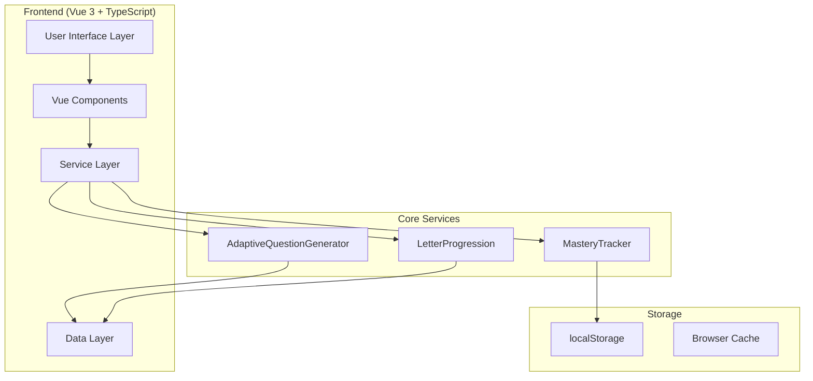
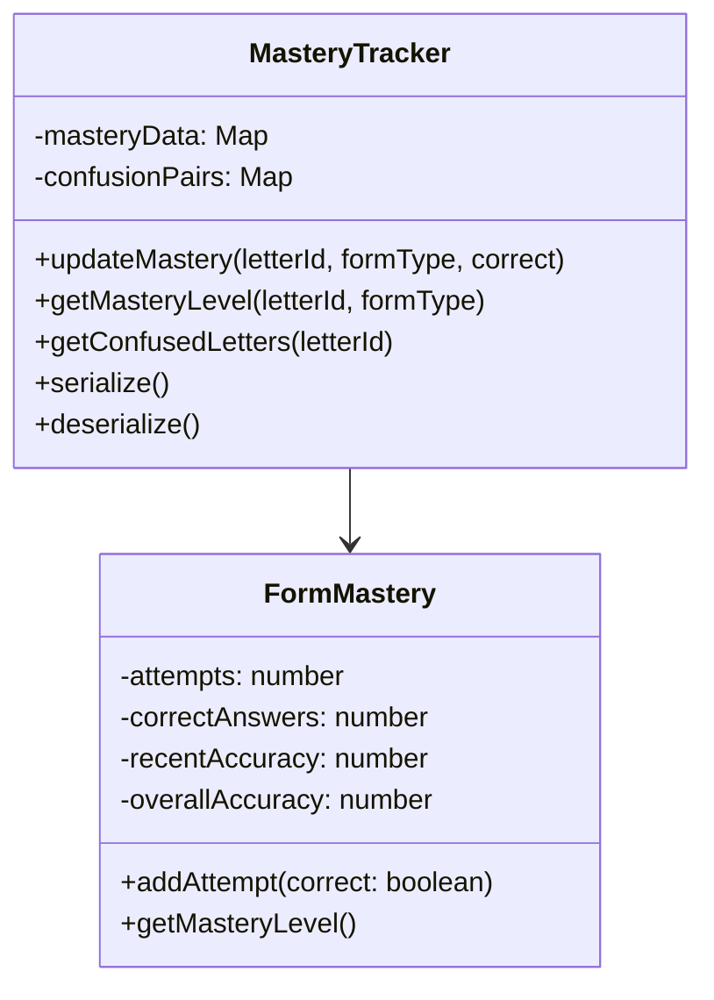
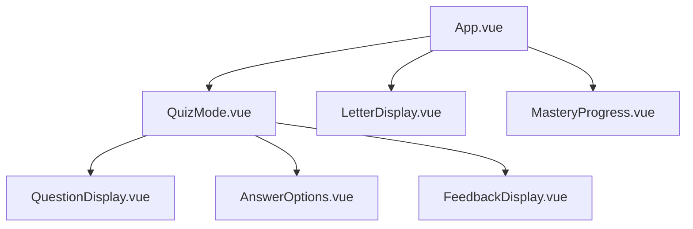
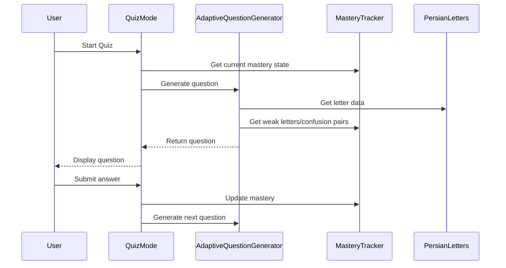
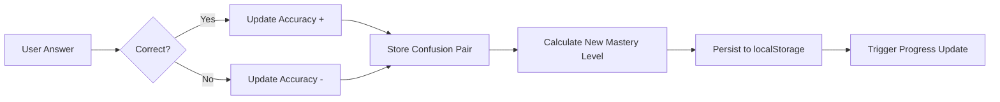

# Architecture

This document provides a detailed technical overview of Aleph's architecture, component structure, and key design decisions.

## System Architecture



## Component Architecture

### Core Components

#### 1. Data Layer (`src/data/`)

**`persianLetters.ts`** - Central data structure containing:
```typescript
interface PersianLetter {
  id: string;
  isolated: string;
  initial: string;
  medial: string;
  final: string;
  nameEn: string;
  nameFa: string;
  pronunciation: string;
  pronunciationSv: string; // Swedish pronunciation hints
  exampleWords: ExampleWord[];
}
```

#### 2. Service Layer (`src/services/`)

**`masteryTracking.ts`** - Progress tracking engine:
- Form-specific mastery tracking (each letter form tracked independently)
- Weighted accuracy calculation (70% recent, 30% historical)
- Confusion pair detection and management
- Contextual mastery (standalone vs in-word recognition)
- Serialization for localStorage persistence



**`adaptiveQuestionGenerator.ts`** - Dynamic question generation:
- Prioritizes weak letters and forms based on mastery data
- Uses confusion pairs to create realistic distractors
- Adapts question types based on learner progress
- Implements spaced repetition algorithms

#### 3. UI Components (`src/components/`)

**Component Hierarchy:**


## Data Flow

### Learning Session Flow


### Mastery Tracking Flow


## Key Design Decisions

### 1. Form-Specific Tracking
**Decision**: Track mastery separately for each letter form (isolated, initial, medial, final).

**Rationale**: Persian letters can look dramatically different in different positions. A learner might recognize `ه` (isolated heh) but struggle with `هـ` (initial heh) because they appear quite different.

**Implementation**: Each letter maintains separate `FormMastery` objects for each applicable form.

### 2. Confusion Pair Detection
**Decision**: Dynamically track which letters users commonly confuse and use this data for question generation.

**Rationale**: Real confusion patterns provide better learning opportunities than predetermined "similar" letters.

**Implementation**: 
```typescript
// Track when user selects wrong answer
if (selectedAnswer !== correctAnswer) {
  confusionPairs.addConfusion(correctAnswer, selectedAnswer);
}

// Use in question generation
const distractors = getConfusedLetters(correctLetter);
```

### 3. Progressive Letter Introduction
**Decision**: Introduce letters in curated groups based on distinctiveness and frequency.

**Rationale**: Prevents cognitive overload while ensuring steady progress.

**Groups**:
1. **Most Distinct**: الف، ب، س، م، د (alef, beh, sin, mim, dal)
2. **High Frequency**: ن، ل، ر، ی، و (nun, lam, reh, yeh, vav)
3. **Dot Patterns**: ت، پ، ج، چ (teh, peh, jim, cheh)
4. **Complex Shapes**: ک، ه، ع، غ (kaf, heh, ain, ghain)
5. **Similar Pairs**: ز، ژ، ص، ض (zeh, zheh, sad, zad)

### 4. Weighted Accuracy Calculation
**Decision**: Recent performance (70%) weighted more heavily than historical (30%).

**Rationale**: Learning is dynamic - recent improvement should quickly influence difficulty rather than being held back by early struggles.

```typescript
const weightedAccuracy = (recentAccuracy * 0.7) + (overallAccuracy * 0.3);
```

### 5. Stateless Architecture
**Decision**: No global state management library (Vuex/Pinia).

**Rationale**: App complexity doesn't justify the overhead. Vue's reactivity system handles state effectively with clean encapsulation in service classes.

## Performance Considerations

### 1. Letter Rendering
- **Challenge**: Persian text shaping and RTL rendering
- **Solution**: Careful CSS to avoid breaking ligatures:
  ```css
  /* Never add padding/margin to individual letters */
  .letter-highlight {
    color: #dc2626;
    /* NO padding, margin, font-weight changes */
  }
  ```

### 2. Local Storage Optimization
- **Approach**: Efficient serialization of mastery data
- **Size**: Typically <50KB for complete progress data
- **Strategy**: Compress by storing only essential metrics

### 3. Question Generation
- **Caching**: Pre-calculate question pools for better performance
- **Lazy Loading**: Generate questions just-in-time to reflect latest mastery state

## Security & Privacy

### Data Handling
- **Local Only**: All data stored in browser localStorage
- **No Tracking**: No analytics or external data collection
- **Privacy First**: Complete offline functionality

### Content Security
- **XSS Protection**: All user input sanitized
- **Content Validation**: Persian text validated for proper encoding

## Testing Strategy

### Unit Tests
- **Services**: Full coverage of mastery tracking logic
- **Components**: Test user interactions and state changes
- **Data**: Validate Persian letter data integrity

### Integration Tests
- **Learning Flow**: End-to-end quiz sessions
- **Persistence**: localStorage save/restore functionality
- **Adaptivity**: Question generation responds correctly to mastery changes

## Browser Compatibility

### Supported Browsers
- **Desktop**: Chrome 90+, Firefox 88+, Safari 14+, Edge 90+
- **Mobile**: iOS Safari 14+, Chrome Mobile 90+

### Known Issues
- **iOS Text Highlighting**: Persian letter highlighting may appear disconnected in iOS WebKit browsers due to RTL text rendering differences

## Development Workflow

### Local Development
```bash
npm install           # Install dependencies
npm run dev          # Start development server
npm run build        # Production build
npm test             # Run test suite
```

### Code Style
- **TypeScript**: Strict mode enabled
- **Vue**: Composition API with `<script setup>`
- **CSS**: Scoped styles with CSS custom properties
- **Formatting**: Prettier + ESLint

### File Structure
```
src/
├── components/          # Vue components
│   ├── QuizMode.vue
│   ├── LetterDisplay.vue
│   └── MasteryProgress.vue
├── services/           # Business logic
│   ├── masteryTracking.ts
│   └── adaptiveQuestionGenerator.ts
├── data/              # Static data
│   └── persianLetters.ts
└── types/             # TypeScript definitions
    └── index.ts
```

This architecture provides a solid foundation for the adaptive learning system while maintaining simplicity and performance.