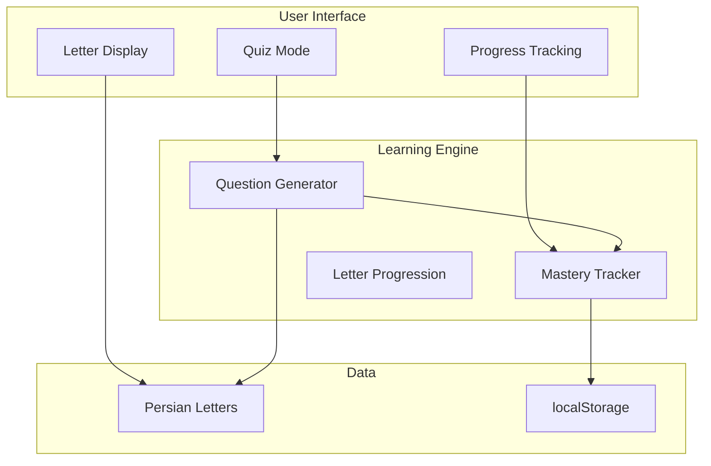

# Aleph Documentation

Welcome to the documentation for **Aleph**, an adaptive Persian alphabet learning application.

## Quick Start

- [Overview](/overview) - Learn about Aleph's features and learning methodology
- [Architecture](/architecture) - Technical documentation and system design

## About Aleph

Aleph is a Vue 3 + TypeScript application that uses adaptive learning algorithms to personalize Persian alphabet instruction. The app tracks mastery of individual letter forms, detects confusion patterns, and dynamically adjusts difficulty to optimize learning outcomes.

### Key Features

🧠 **Adaptive Learning** - Personalized instruction based on individual progress  
📚 **Comprehensive Content** - All 32 Persian letters with pronunciation guides  
🎯 **Intelligent Quizzing** - Multiple question types that adapt to your skill level  
🎨 **Modern Interface** - Dark mode, keyboard shortcuts, and responsive design

## Demo

Try the live application to experience the adaptive learning system in action.

## Architecture Overview

The system continuously adapts to user performance, introducing new letters when ready and focusing practice on areas that need improvement.
