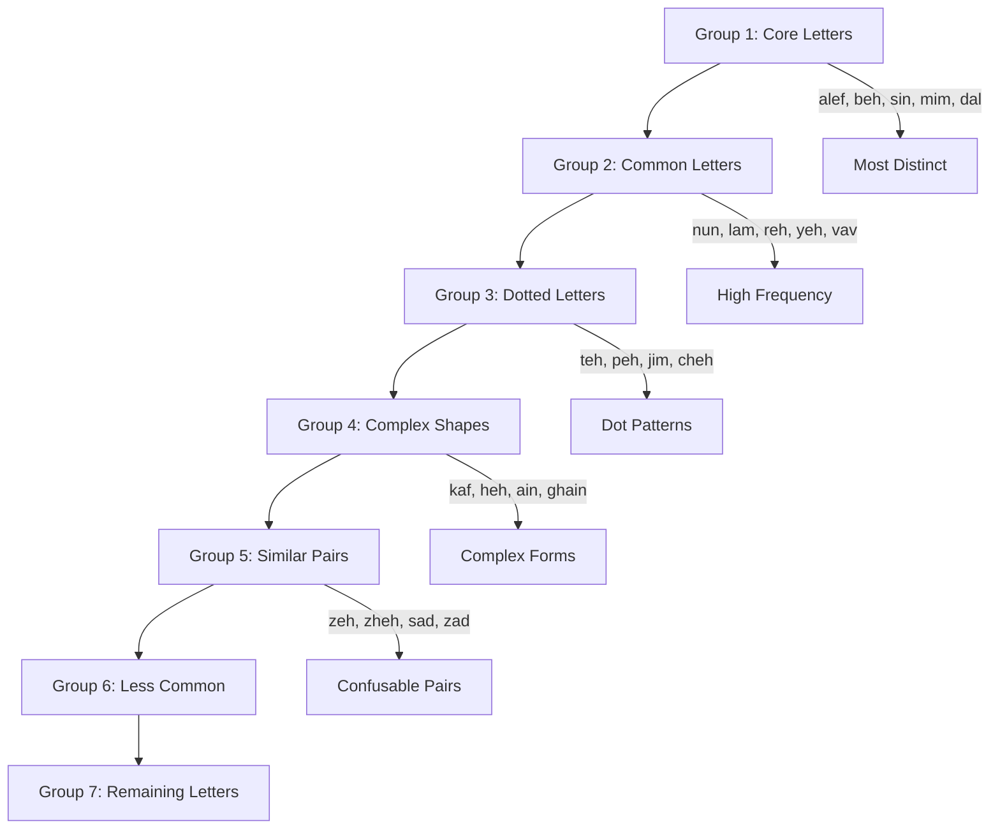

# Aleph Overview

Aleph is a sophisticated Persian alphabet learning application built with Vue 3 and TypeScript, featuring an adaptive learning system that personalizes the educational experience based on individual progress and mastery patterns.

## What is Aleph?

Aleph helps users learn the Persian (Farsi) alphabet through an intelligent, adaptive quiz system. Unlike traditional learning apps that follow a fixed curriculum, Aleph dynamically adjusts to each learner's strengths and weaknesses, providing a truly personalized learning experience.

## Key Features

### 🧠 Adaptive Learning System
- **Form-specific tracking**: Each Persian letter has up to 4 different forms (isolated, initial, medial, final) - Aleph tracks mastery of each form separately
- **Confusion pair detection**: The system identifies which letters you commonly confuse and uses them strategically as quiz distractors
- **Weighted accuracy**: Recent performance (70%) is weighted more heavily than historical performance (30%) for responsive adaptation
- **Progressive letter introduction**: New letters are introduced only when you've demonstrated sufficient mastery of current ones

### 📚 Comprehensive Content
- **Complete letter set**: All 32 Persian alphabet letters with their various forms
- **Pronunciation guides**: Both English transliteration and Swedish pronunciation hints for Swedish speakers
- **Example words**: Each letter includes example words with transliteration and meanings
- **Contextual learning**: Practice recognizing letters both in isolation and within words

### 🎯 Intelligent Quiz System
Multiple question types adapt to your learning progress:
- **Letter recognition**: Identify letters from their visual form
- **Name to letter**: Match letter names to their visual representation
- **Form recognition**: Distinguish between different forms of the same letter
- **Word context**: Identify specific letters within Persian words

### 🎨 User Experience
- **Dark mode support**: Seamless dark/light theme switching with persistent preference
- **Keyboard shortcuts**: Fast navigation with number keys (1-4) for answers, Enter/Space for progression
- **Auto-progression**: Correct answers automatically advance after 1.5 seconds for fluid learning
- **Infinite practice mode**: Continuous learning sessions that adapt in real-time
- **High DPI optimization**: Crisp text rendering optimized for modern displays

## Learning Methodology

### Spaced Repetition
Aleph implements an intelligent spaced repetition system where:
- Letters you struggle with appear more frequently
- Mastered letters appear less often but aren't forgotten
- The system prevents overload by limiting active letters based on your progress

### Mastery Levels
The app tracks four distinct mastery levels:
- **Learning** (0%): Just introduced, needs frequent practice
- **Familiar** (60%+): Basic recognition achieved
- **Proficient** (80%+): Strong understanding, occasional review
- **Mastered** (95%+): Excellent retention, minimal review needed

### Progressive Unlocking
Letters are introduced in carefully designed groups:

## Technology Stack

- **Frontend**: Vue 3 with Composition API
- **Language**: TypeScript for type safety
- **Styling**: Scoped CSS with CSS variables for theming
- **Typography**: Vazir font for optimal Persian text rendering
- **Storage**: localStorage for progress persistence
- **Testing**: Vitest for unit testing

## Getting Started

The app requires no setup or account creation. Simply start the quiz and Aleph will:

1. Begin with 5 fundamental letters
2. Track your performance on each letter form
3. Introduce new letters when you're ready
4. Adapt question difficulty based on your mastery
5. Provide continuous feedback and progress tracking

Your progress is automatically saved locally, so you can pick up exactly where you left off.

## Target Audience

Aleph is designed for:
- **Beginners** learning the Persian alphabet from scratch
- **Intermediate learners** wanting to strengthen letter recognition
- **Self-directed learners** who prefer adaptive, personalized education
- **Swedish speakers** (includes Swedish pronunciation guides)
- **Anyone** interested in efficient, science-based language learning

The adaptive system ensures that both complete beginners and those with some Persian knowledge can benefit from personalized instruction at their appropriate level.